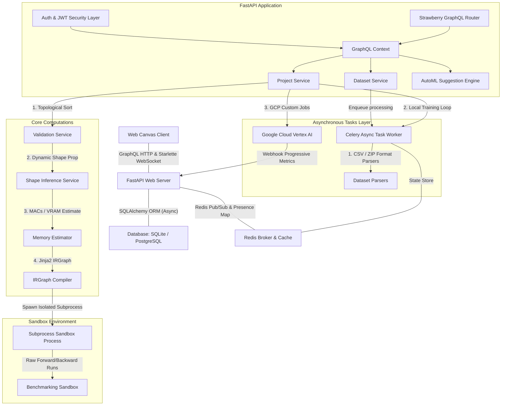
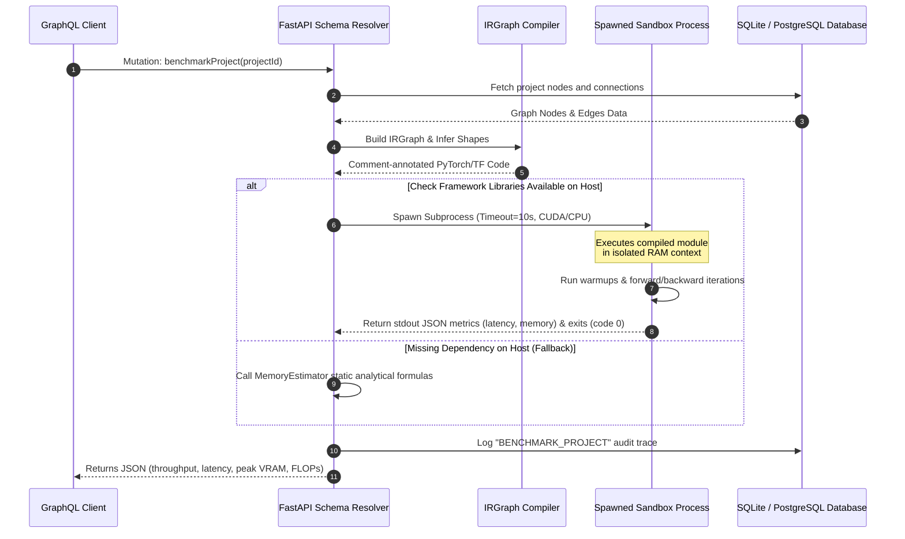
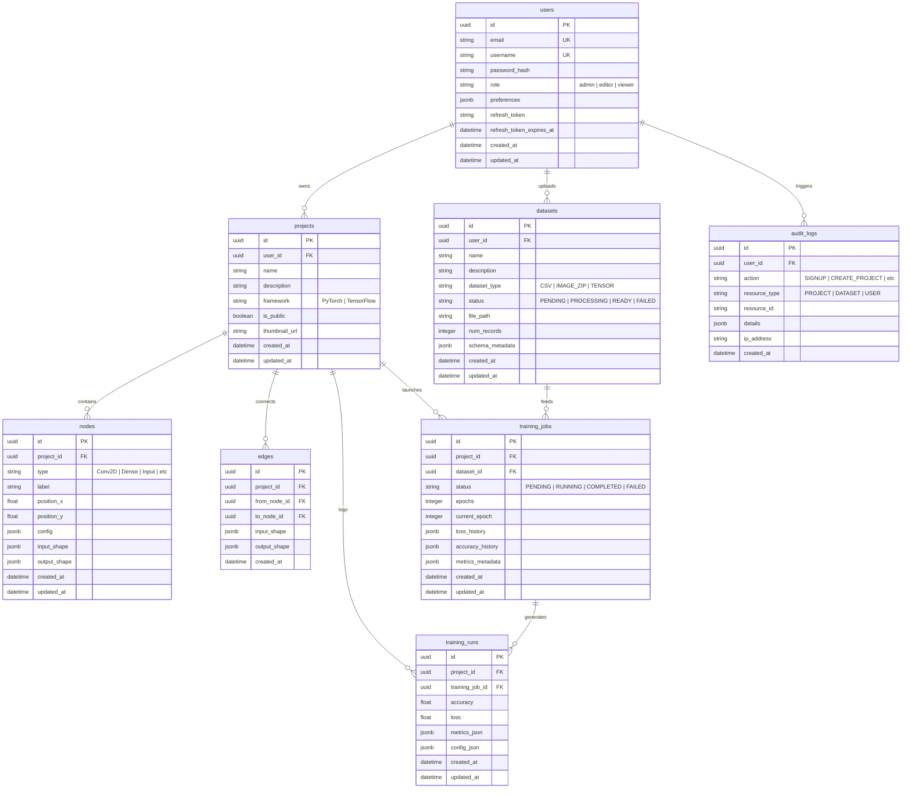
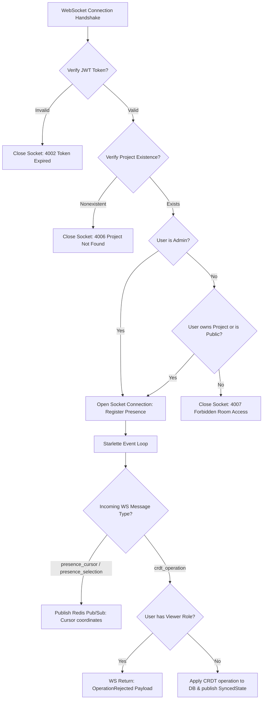
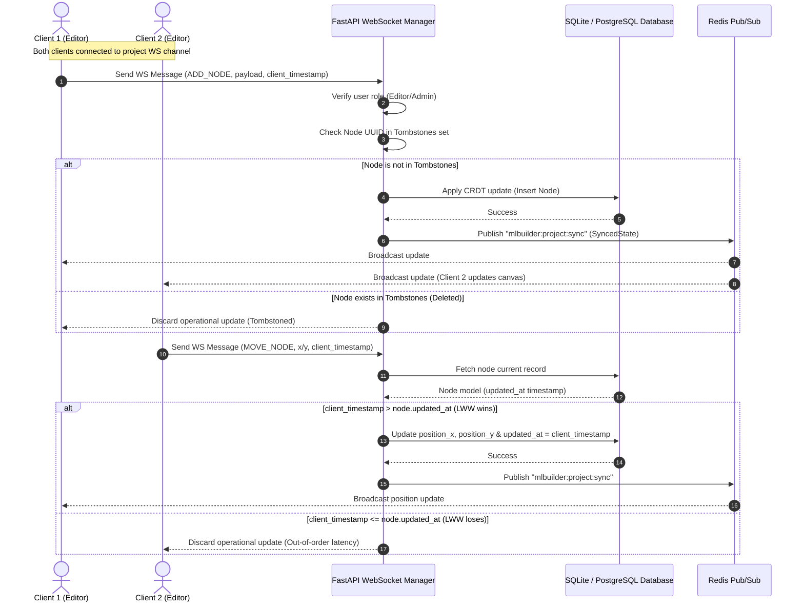
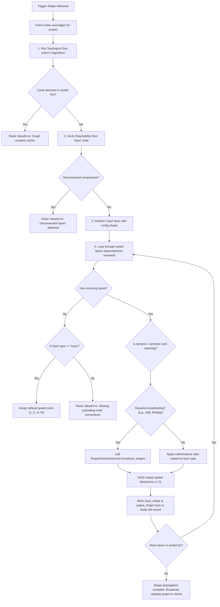
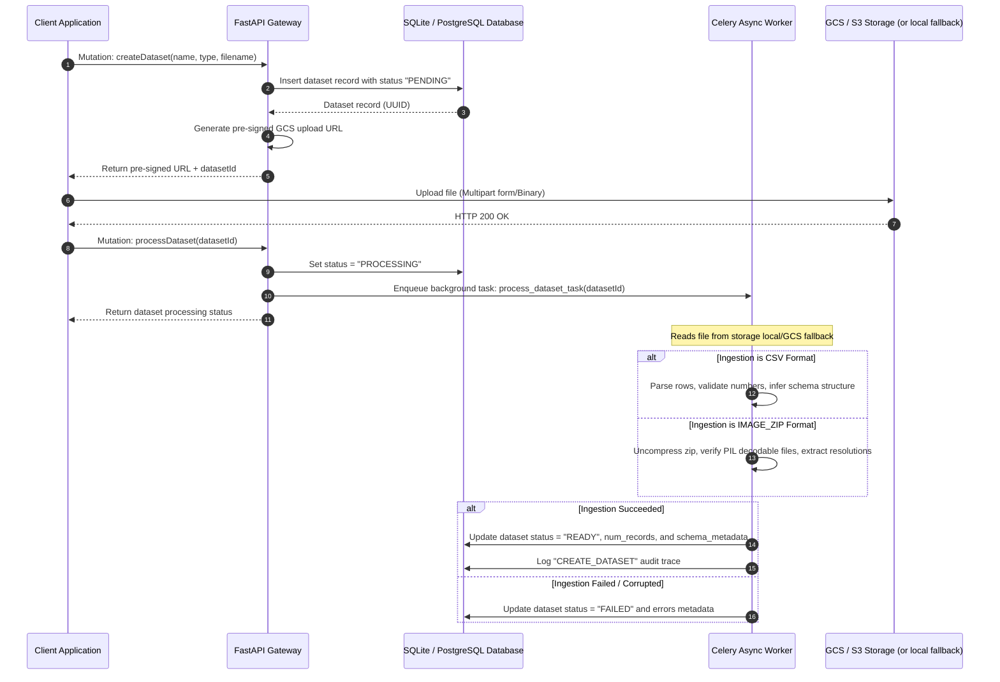
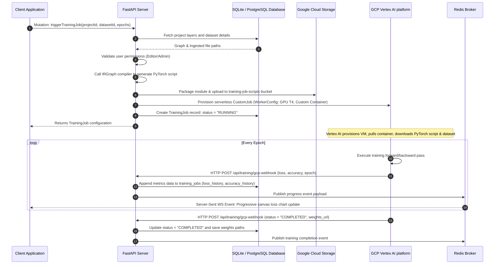

# MLBuilder Backend - Production-Ready API Server

<p align="center">
  
</p>

<h1 align="center">MLBuilder</h1>

<p align="center">
  <strong>Visual Neural Architecture IDE</strong>
</p>

<p align="center">
  Build • Validate • Benchmark • Train • Collaborate
</p>

<p align="center">
  
  
  
  
  
  
</p>

---

## ✨ Platform Overview

MLBuilder is a graph-native AI infrastructure platform that combines:

- visual neural architecture engineering,
- deterministic DAG execution,
- symbolic tensor propagation,
- CRDT-powered collaboration,
- sandboxed benchmarking,
- AutoML diagnostics,
- and cloud-scale Vertex AI orchestration.

Unlike traditional code-first ML tooling, MLBuilder introduces a fully interactive computational graph IDE capable of compiling visual architectures directly into executable deep learning frameworks.

MLBuilder is a visual machine learning architecture designer that enables developers to build, validate, benchmark, and compile deep learning models directly from an interactive web canvas. 

This repository houses the production-grade, asynchronous FastAPI backend. It coordinates user authentication, real-time collaboration sessions, graph-based canvas CRUD operations, Directed Acyclic Graph (DAG) validation, shape inference calculations, process-sandboxed model benchmarking, AutoML structural advisors, GCS storage ingestion, and serverless GCP Vertex AI training pipelines.

# ⚡ Core Platform Capabilities

| Capability | Status | Description |
|---|---|---|
| DAG Validation | ✅ | Deterministic topological graph validation supporting Transformers, recurrent networks, and GNNs |
| Shape Inference | ✅ | Multi-dimensional symbolic tensor propagation (V2 supporting sequence and graph dimensions) |
| PyTorch Compilation | ✅ | IRGraph → executable PyTorch generation (modularized compiler architecture) |
| TensorFlow Compilation | ✅ | Fully compliant TensorFlow/Keras code generation supporting custom blocks |
| JAX/Flax Compilation | ✅ | Advanced JAX/Flax compiler mapping code into functional and stateful layers |
| CRDT Collaboration | ✅ | Real-time collaborative graph editing |
| Redis Synchronization | ✅ | Distributed Pub/Sub event orchestration |
| Sandbox Benchmarking | ✅ | Isolated subprocess performance execution |
| AutoML Diagnostics | ✅ | AI structural anti-pattern detection |
| Vertex AI Training | ✅ | Cloud-scale serverless GPU training |
| Training Engine | ✅ | In-memory dynamic PyTorch compile/load training |
| Experiment Tracking | ✅ | DB persistence, run histories and comparison |
| RBAC Security | ✅ | Enterprise-grade permission boundaries |
| Audit Logging | ✅ | Transactional event trace persistence |
| Dataset Ingestion | ✅ | CSV / ZIP / tensor dataset processing |
| WebSocket Collaboration | ✅ | Real-time synchronized editing sessions |
| Dockerized Infrastructure | ✅ | Fully containerized deployment stack |
| Benchmark Metrics | ✅ | FLOPs, latency, throughput, VRAM |

# 🌌 Why MLBuilder Exists

Modern deep learning tooling remains heavily code-centric, difficult to visualize, and fragmented across disconnected ecosystems.

Developers frequently struggle with:

- debugging tensor dimensionality mismatches,
- understanding computational graph flow,
- validating complex architectures,
- benchmarking safely,
- orchestrating cloud training,
- and collaborating visually on large neural systems.

MLBuilder was engineered to solve these problems by introducing a graph-native AI systems IDE capable of:

- deterministic graph execution,
- live tensor propagation,
- compiler-grade architecture validation,
- distributed collaboration,
- cloud orchestration,
- and framework-level code generation.

The platform merges concepts from:

- visual programming systems,
- compiler pipelines,
- ML infrastructure tooling,
- and distributed collaborative editors.

---

## 🚀 System Architecture & Decoupled Pipelines

The backend is built using a highly decoupled, layered architecture to isolate presentation, business logic, asynchronous tasks, external cloud adapters, and secure subprocess sandboxes.

# 🧠 Core Engineering Innovations

| Innovation | Why It Matters |
|---|---|
| Deterministic DAG Execution | Prevents cyclic architectures and guarantees execution ordering |
| Symbolic Shape Inference | Eliminates invalid tensor dimension propagation |
| IRGraph Compiler Pipeline | Enables framework abstraction and reusable compilation logic |
| CRDT Synchronization | Allows concurrent multi-user graph editing without lock contention |
| Sandbox Benchmarking | Executes compiled models safely in isolated subprocesses |
| Vertex AI Integration | Enables scalable cloud GPU orchestration |
| Dynamic Training Engine | Dynamically loads and trains PyTorch graphs in memory |
| Experiment Tracking | Auto-persists metrics, speed, VRAM, and hyperparameters |
| AutoML Structural Diagnostics | Detects parameter explosions and architectural anti-patterns |
| Redis Pub/Sub Presence Layer | Synchronizes live collaborative editing sessions |
| RBAC + Audit Logging | Provides enterprise-grade security and operational traceability |


# 🏗️ High-Level Platform Flow

```text
Frontend Canvas IDE
        ↓
GraphQL API Layer
        ↓
Validation Engine
        ↓
Shape Inference Engine
        ↓
IRGraph Compiler
        ↓
Sandbox Benchmarking / Vertex AI Training
```

### Dynamic Training Engine Pipeline Flow

```mermaid
graph TD
    subgraph Training Engine Pipeline
        Start["Trigger Job (Mutation / Local Fallback)"] --> load_proj["1. Fetch Project, Nodes & Edges"]
        load_proj --> compile_proj["2. Topologically Sort & Compile model to PyTorch"]
        compile_proj --> load_ds["3. Download Dataset (Local/S3/GCS) & Parse format (CSV/ZIP/Npy)"]
        load_ds --> dataloader["4. Initialize PyTorch DataLoader (Shuffle/Batch)"]
        dataloader --> init_model["5. Dynamically load/instantiate MLBuilderModel onto Device (CPU/CUDA)"]
        init_model --> train_loop["6. Train Loop: Forward pass -> Compute loss -> Backpropagation"]
        train_loop --> validate_loop["7. Validation Loop: Compute evaluation metrics"]
        validate_loop --> telemetry["8. Publish telemetry over Redis & update TrainingJob DB state"]
        telemetry --> epoch_check{"More Epochs?"}
        epoch_check -->|Yes| train_loop
        epoch_check -->|No| save_run["9. Save final metrics & create TrainingRun (Experiment) record"]
    end
```


### 1. Global Decoupled Data Flow


---

### 2. Sandbox Compilation & Benchmarking Pipeline


---

## 📊 Database Schema Entity-Relationship Model

The persistent layer is modeled using SQLAlchemy 2.0 declarative models, tracking relational linkages and document configurations.



---

## 🔒 Enterprise Role-Based Access Control (RBAC)

The platform supports robust, enterprise-grade access boundaries segregating administrative operations, creator tasks, and read-only compliance access.

### 1. Global Role Permissions Matrix

| API Operation / Field | viewer | editor | admin | Security Enforcement Method |
| :--- | :---: | :---: | :---: | :--- |
| **Query `me` / `project` (owned)** | ✅ | ✅ | ✅ | Context User Verification |
| **Query `project` (other private)** | ❌ | ❌ | ✅ | Skip Owner Check (Admin Bypass) |
| **Query `project` (other public)** | ✅ | ✅ | ✅ | Public Project Read Permission |
| **Query `auditLogs`** | ❌ | ❌ | ✅ | Role check: strict `"admin"` constraint |
| **Mutation `updateUserRole`** | ❌ | ❌ | ✅ | Role check: strict `"admin"` constraint |
| **Mutation `createProject`** | ❌ | ✅ | ✅ | Allowed roles: `["admin", "editor"]` |
| **Mutations `addNode` / `deleteNode`**| ❌ | ✅ | ✅ | Enforce Project Ownership check |
| **Mutation `benchmarkProject`** | ❌ | ✅ | ✅ | Enforce Project Ownership check |
| **Mutation `triggerTrainingJob`** | ❌ | ✅ | ✅ | Enforce Project & Dataset Ownership |
| **Query `trainingRuns`** | ✅ | ✅ | ✅ | Enforce Project Read Permission |
| **Query `trainingRun`** | ✅ | ✅ | ✅ | Enforce Project Read Permission |

---

### 2. WebSocket Collaboration Presence & Security Guards


---

### 3. Action Auditing & Records Schema

The `AuditLog` table records all significant state-altering operations inside the backend, preserving metadata details and client coordinates:

| Audit Action Code | Resource | Detail Parameters Logged | IP Captured? | Trigger Event |
| :--- | :--- | :--- | :---: | :--- |
| **`SIGNUP`** | `USER` | None | ✅ | New account registration |
| **`LOGIN`** | `USER` | None | ✅ | JWT bearer authentication |
| **`CREATE_PROJECT`** | `PROJECT` | Name, Target Framework (e.g. PyTorch) | ✅ | Creation of canvas |
| **`IMPORT_PROJECT`** | `PROJECT` | Workspace name | ✅ | Serialized JSON file compilation |
| **`ADD_NODE`** | `NODE` | Project ID, Layer type, label | ✅ | Addition of canvas nodes |
| **`DELETE_NODE`** | `NODE` | Project ID, node identifier | ✅ | Deletion of nodes |
| **`CREATE_DATASET`** | `DATASET` | Dataset name, format (CSV/ZIP) | ✅ | Registering new raw datasets |
| **`TRIGGER_TRAINING_JOB`**| `PROJECT` | Epoch sizes, dataset targets | ✅ | Inception of Vertex AI GPU container |
| **`BENCHMARK_PROJECT`** | `PROJECT` | Project canvas ID | ✅ | Initiating sandbox speedruns |
| **`UPDATE_USER_ROLE`** | `USER` | Target User ID, old role, newly assigned role| ✅ | Admin reallocating permissions |

---

## 🤝 Asynchronous CRDT Synchronization and Live Collaboration

To facilitate zero-latency, concurrent workspace design without lock contentions, visual mutations utilize Conflict-Free Replicated Data Types (CRDT) backed by Last-Write-Wins (LWW) resolution and persistent Tombstones.



---

## 📈 Multi-dimensional Shape Propagation and Validation Pipeline

As layers are modified on the visual canvas, the backend dynamically calculates multi-dimensional activation shapes, validates dimension rules, and checks the graph structure for cyclic connections.



---

## 📥 Dataset Ingestion, Validation, and Compression Workflow

Ingesting multi-modal raw datasets (such as CSV spreadsheets or image compression archives) is dispatched to secure background worker pools, handling chunked verification, automatic formatting, and structure classification.



---

## 🤖 AI/ML Features: Sandbox & Suggestion Math

MLBuilder contains a high-performance symbolic calculations and isolated compilation engine to measure framework models safely.

### 1. Model Sandbox Benchmarker Metrics

The sandbox execution fork runs forward and backward iterations on simulated models using standard hardware fallbacks:

| Metric | Measurement Unit | Offline Fallback / Calculation Method |
| :--- | :--- | :--- |
| **Execution Latency** | Milliseconds (ms) | `time.perf_counter` iterations in subprocess forward passes |
| **Throughput Capacity**| Samples/sec (FPS) | Reconciled reciprocal: $1 / \text{latency}$ evaluated at batch size |
| **System Memory Usage**| Megabytes (MB) | Parent processes RAM scan using `psutil` wrapper library |
| **Peak GPU VRAM** | Megabytes (MB) | `torch.cuda.max_memory_allocated()` or static estimates |
| **FLOP Complexity** | Operations (FLOPs)| Layer-by-layer multiply-accumulate mathematical formulas |

---

### 2. Parameter, VRAM & FLOP Mathematical Formulas

Below are the analytical mathematical formulations utilized by the `MemoryEstimator` to compute operational complexities across networks:

| Node Type | Parameter Count Formula | Memory Footprint (Activation Bytes) | Floating-Point Operations (FLOPs) |
| :--- | :--- | :--- | :--- |
| **`Input`** | $0$ | $B \cdot C \cdot H \cdot W \cdot 4$ | $0$ |
| **`Dense` / `Linear`** | $(C_{in} \cdot C_{out}) + C_{out}$ (if bias) | $B \cdot C_{out} \cdot 4$ | $2 \cdot B \cdot C_{in} \cdot C_{out}$ |
| **`Conv2D`** | $((C_{in} \cdot K_h \cdot K_w) \cdot C_{out}) + C_{out}$ | $B \cdot C_{out} \cdot H_{out} \cdot W_{out} \cdot 4$| $2 \cdot B \cdot (C_{in} \cdot K_h \cdot K_w) \cdot H_{out} \cdot W_{out} \cdot C_{out}$|
| **`MaxPool2D` / `AvgPool`** | $0$ | $B \cdot C_{out} \cdot H_{out} \cdot W_{out} \cdot 4$| $B \cdot C_{in} \cdot (K_h \cdot K_w) \cdot H_{out} \cdot W_{out}$ |
| **`BatchNorm` / `BatchNorm2D`** | $2 \cdot C_{in}$ (gamma, beta learnable coefficients) | $B \cdot C_{out} \cdot H_{out} \cdot W_{out} \cdot 4$| $2 \cdot B \cdot C_{in} \cdot H_{out} \cdot W_{out}$ (element-wise scale) |
| **`Embedding`** | $V_{vocab\_size} \cdot D_{embed}$ | $B \cdot T \cdot D_{embed} \cdot 4$ | $0$ (Sparse index table lookup) |
| **`LSTM` / `GRU` / `RNN`** | $\text{gate\_mult} \cdot H_{size} \cdot (C_{in} + H_{size})$ | $B \cdot T \cdot H_{size} \cdot 4$ (assuming sequence return) | $2 \cdot \text{gate\_mult} \cdot B \cdot T \cdot (C_{in} + H_{size}) \cdot H_{size}$ |
| **`Bidirectional LSTM / BiLSTM`** | $2 \cdot (\text{LSTM Parameter Count})$ | $2 \cdot B \cdot T \cdot H_{size} \cdot 4$ (assuming sequence return) | $2 \cdot (\text{LSTM FLOPs Count})$ |
| **`Multi-Head Attention / Attention`**| $4 \cdot D_{model}^2 + 4 \cdot D_{model}$ | $(B \cdot N_{heads} \cdot T \cdot T + B \cdot T \cdot D_{model}) \cdot 4$| $4 \cdot B \cdot T^2 \cdot D_{model}$ (Approximate scaled dot product) |
| **`Positional Encoding`** | $T_{max} \cdot D_{embed}$ | $B \cdot T \cdot D_{embed} \cdot 4$ | $B \cdot T \cdot D_{embed}$ |
| **`Residual Add`** | $0$ | $B \cdot D_{embed} \cdot 4$ | $B \cdot D_{embed} \cdot (N_{inputs} - 1)$ |
| **`Transformer / Encoder Block`** | $12 \cdot D_{model}^2$ | $(B \cdot N_{heads} \cdot T \cdot T + B \cdot T \cdot D_{model}) \cdot 4$ | $4 \cdot B \cdot T^2 \cdot D_{model} + 24 \cdot B \cdot T \cdot D_{model}^2$ |
| **`Decoder Block`** | $16 \cdot D_{model}^2$ | $(2 \cdot B \cdot N_{heads} \cdot T \cdot T + B \cdot T \cdot D_{model}) \cdot 4$ | $8 \cdot B \cdot T^2 \cdot D_{model} + 32 \cdot B \cdot T \cdot D_{model}^2$ |
| **`GCN`** | $C_{in} \cdot C_{out}$ | $N_{nodes} \cdot C_{out} \cdot 4$ | $2 \cdot N_{nodes} \cdot C_{out} \cdot (C_{in} + N_{nodes})$ |
| **`GraphSAGE`** | $2 \cdot C_{in} \cdot C_{out}$ | $N_{nodes} \cdot C_{out} \cdot 4$ | $2 \cdot N_{nodes} \cdot C_{in} \cdot (N_{nodes} + 2 \cdot C_{out})$ |
| **`GAT`** | $N_{heads} \cdot C_{in} \cdot C_{out} + 2 \cdot N_{heads} \cdot C_{out}$ | $N_{nodes} \cdot C_{out} \cdot 4$ | $2 \cdot N_{nodes} \cdot C_{out} \cdot (C_{in} + N_{nodes}) \cdot N_{heads}$ |

*(Where $B$ is batch size, $T$ is sequence length, $C$ represents channels, $K$ represents kernel dimensions, $H$ and $W$ represent height and width coordinates, $\text{gate\_mult}$ equals $4$ for LSTM, $3$ for GRU, and $1$ for SimpleRNN)*

---

### 3. AutoML Advisor Diagnostic Anti-patterns

The `AutoMLSuggestionEngine` analyzes neural network DAG structures to flag structural risks, offering visual debugging guides:

| Anti-pattern Bottleneck | Trigger Severity | Structural Root Pattern | Recommended Action |
| :--- | :---: | :--- | :--- |
| **Parameter Explosion** | `HIGH` | `Conv2D`/`ConvTranspose2D` layer connected directly into a `Dense`/`Linear` layer without pooling or flattening, causing a massive weights multiplication ($H_{in} \cdot W_{in} > 49$). | Insert a `GlobalAveragePooling2D` or `Flatten` layer between convolutions and classifiers. This can save up to 99% of dense parameter memory. |
| **Vanishing Gradient Risk**| `MEDIUM` | Chain of consecutive convolution layers exceeding a threshold depth of 6 without any batch normalization layers to stabilize intermediate activation distributions. | Insert `BatchNorm2D` layers after deeper convolutional steps to scale training and enable stable backpropagation gradients. |
| **Overfitting / Missing Regularization**| `MEDIUM` | `Dense` layers with extremely high hidden units capacities (e.g., $> 512$) without dropout rate regularizers or weight decay variables. | Append a `Dropout` layer (rates $0.2 \sim 0.5$) after high-dimensional dense matrices to mute activations during iterations. |
| **Consecutive Linear Transformations** | `LOW` | Multiple successive `Dense` or `Conv2D` layers whose activation configuration is set to `None` or `"linear"`, collapsing model capacity. | Specify a non-linear activation function (such as `"ReLU"`, `"SiLU"`, or `"GELU"`) in the properties of the layers to sustain computational rank. |

```mermaid
graph TD
    Start["Initiate AutoML Scan"] --> fetch["Fetch nodes & connections"]
    fetch --> maps["Build forward/backward adjacency maps"]
    
    maps --> scan_pe["1. Scan for Parameter Explosion"]
    scan_pe --> check_pe{"Is Dense connected directly after Conv2D without Pooling?"}
    check_pe -->|Yes| pe_calc["Estimate params saving via GlobalAveragePooling (HxW spatial reduced to 1x1)"]
    pe_calc --> pe_rec["Append HIGH severity: Insert GlobalAveragePooling2D / MaxPool2D"]
    check_pe -->|No| scan_vg["2. Scan for Vanishing Gradient Risk"]
    
    pe_rec --> scan_vg
    scan_vg --> check_vg{"Chain of Convolution layers > 6 without BatchNorm?"}
    check_vg -->|Yes| vg_rec["Append MEDIUM severity: Inject BatchNorm2D / BatchNorm"]
    check_vg -->|No| scan_overfit["3. Scan for Overfitting Risk"]
    
    vg_rec --> scan_overfit
    scan_overfit --> check_over{"Wide Dense layer (units > 512) without subsequent Dropout?"}
    check_over -->|Yes| over_rec["Append MEDIUM severity: Append a Dropout layer (rate 0.3 - 0.5)"]
    check_over -->|No| scan_linear["4. Scan for Consecutive Linear Transforms"]
    
    over_rec --> scan_linear
    scan_linear --> check_linear{"Consecutive Dense/Conv layers without non-linear activations?"}
    check_linear -->|Yes| lin_rec["Append LOW severity: Specify ReLU / SiLU activations"]
    check_linear -->|No| compile["Compile Suggestions List"]
    
    lin_rec --> compile
    compile --> check_empty{"Any suggestions generated?"}
    check_empty -->|Yes| return_list["Return suggestions payload containing severity & action details"]
    check_empty -->|No| return_ok["Return: Architecture fully optimized message (Severity: NONE)"]
```



---

## ☁️ Cloud Training Orchestration: Serverless Vertex AI Pipelines

For enterprise-scale model training, MLBuilder packages compiled Python modules, formats target training datasets, uploads script artifacts, and initiates custom serverless container jobs inside Google Cloud Vertex AI.




---

## 🛠️ Detailed Technology Stack

| Component | Technology | Version | Purpose in Production |
| :--- | :--- | :---: | :--- |
| **Web Server Core** | [FastAPI](https://fastapi.tiangolo.com/) | `0.110+` | High-performance asynchronous execution of HTTP and WebSocket routing. |
| **GraphQL API** | [Strawberry GraphQL](https://strawberry.rocks/) | `0.219+` | Strongly typed GraphQL schemas mapping queries, mutations, and structural inputs. |
| **ORM & Driver** | [SQLAlchemy](https://www.sqlalchemy.org/) | `2.0+` | Unified schema definition with async capability and relational pooling. |
| **Task Coordinator**| [Celery](https://docs.celeryq.dev/) | `5.3+` | Manages long-running asynchronous schema parsing and progressive training task pools.|
| **Message Broker** | [Redis](https://redis.io/) | `7.0+` | Shared communication backplane for Celery tasks, WebSockets presence maps, and pub/sub. |
| **Database** | [PostgreSQL](https://www.postgresql.org/) | `15+` | Stores relational models and node configurations using JSONB document fields. |
| **Code Compiler** | [Jinja2](https://jinja.palletsprojects.com/) | `3.1+` | Framework-agnostic IRGraph compiler transforming graphs into coment-annotated PyTorch scripts.|
| **Cryptography** | [Bcrypt & PyJWT](https://github.com/pyca/bcrypt/) | Latest | Dynamic password hashing and stateful JWT token validation with auto-rotation hooks. |

---

## 🛜 WebSocket Close Status Codes

To prevent authentication leaks and communicate specific room boundary failures, the Starlette WebSocket router utilizes standard and custom close statuses:

| WebSocket Close Code | Reason Identifier | Logical Enforcement Context |
| :---: | :--- | :--- |
| **`4001`** | `InvalidAuthorizationFormat` | The `Authorization` header is improperly formatted or missing. |
| **`4002`** | `TokenExpiredOrInvalid` | Token validation failed, or signature checks encountered exceptions. |
| **`4006`** | `ProjectNotFound` | The `projectId` parameter requested during handshake does not exist in the database. |
| **`4007`** | `ForbiddenRoomAccess` | A non-admin user attempted room entry without ownership privileges or public status. |
| **`1000`** | `NormalClosure` | Clean disconnect requested by client. |
| **`1011`** | `InternalServerError` | Uncaught server exception within Starlette event loop handler. |

---

## 📂 Project Directory Structure

```text
├── app/
│   ├── main.py                # FastAPI Application bootstrapping & GCP webhooks
│   ├── config/
│   │   ├── settings.py        # Environmental settings validation & Pydantic config
│   │   ├── database.py        # SQLAlchemy engine, session maker & declarative base
│   │   ├── logging.py         # JSON-formatted structured production logging
│   │   └── health.py          # Deep health checks (DB, Redis, Celery connection checks)
│   ├── auth/
│   │   ├── security.py        # Password hashing & JWT cryptography
│   │   ├── dependencies.py    # FastAPI HTTPBearer retrieval & GraphQL Context
│   │   └── rbac.py            # RBAC verify_role_and_ownership checks
│   ├── models/
│   │   ├── __init__.py        # Metadata model registration hooks
│   │   ├── user.py            # User credentials & global roles (admin/editor/viewer)
│   │   ├── project.py         # Canvas workspaces metadata
│   │   ├── node.py            # Canvas layers configurations (JSONB)
│   │   ├── edge.py            # Connections routing & dynamic shapes
│   │   ├── dataset.py         # Ingested datasets configurations & states
│   │   ├── training_job.py    # Cloud telemetry logs & epochs histories
│   │   └── audit_log.py       # Enterprise system change event logs
│   ├── services/
│   │   ├── auth_service.py    # Auth lifecycle
│   │   ├── project_service.py # Project and canvas elements CRUD
│   │   ├── validation_service.py # Topological sorting, broadcasting & framework compatibility
│   │   ├── shape_inference_service.py # Multi-dimensional dynamic shape math
│   │   ├── s3_service.py      # Pre-signed GCS/S3 PUT links & local fallbacks
│   │   ├── dataset_service.py # Automated format parsers (CSV, Image ZIP, Npy)
│   │   ├── automl_engine.py   # Diagnostics scanning for parameter explosions & vanishing risks
│   │   ├── benchmarking_service.py # Isolated process sandboxed model telemetry (ms, FLOPs)
│   │   ├── cloud_training_service.py # Vertex AI cloud adapter triggers
│   │   ├── training_service.py # Dynamic compiling loader & training/validation loops
│   │   └── audit_service.py   # Enterprise log recorder
│   ├── graphql/
│   │   ├── schema.py          # Queries, Mutations, and extensions registration
│   │   ├── ws_router.py       # Starlette WebSocket router for collaborative CRDT presence
│   │   └── types/             # Strawberry GraphQL Types schemas definitions
│   ├── workers/
│   │   └── training_worker.py # Background dynamic training loop Celery task
│   └── tasks/
│       ├── celery_app.py      # Celery task configuration
│       ├── tasks.py           # Background async compilation
│       └── training_tasks.py  # Local offline simulated training loops
├── tests/                     # Automated unit and integration test suites
│   ├── conftest.py            # Shared SQLite temporary database fixtures
│   ├── test_ai_ml_features.py # Tests Vertex AI training, AutoML suggestion engine, GCS, benchmarks
│   ├── test_enterprise_features.py # Tests viewer restriction matrices, admin bypasses, WebSocket locks
│   └── ...                    # Core compilation and validation tests
├── requirements.txt           # Package requirements specifications
├── Dockerfile                 # Slim multi-stage production Docker setup
└── docker-compose.yml         # Container Orchestrator configuration
```

---

## ⚙️ Setup & Local Installation

### Option A: The Detached Container Stack (Docker Compose)
This spins up the entire production stack (FastAPI web server, PostgreSQL database, Redis task broker, and Celery worker threads) in detached containers, mounting storage volumes automatically:

```bash
# Clone the repository and navigate into the workspace
cd backend

# Build and start all services in detached mode
docker-compose up --build -d
```
The GraphQL interactive Playground will be available immediately at: **`http://localhost:8000/graphql`**

---

### Option B: Local Running (Development Environment)

**1. Set up Virtual Environment & Install requirements:**
```bash
python -m venv venv
# On Windows
venv\Scripts\activate
# On macOS/Linux
source venv/bin/activate

pip install -r requirements.txt
```

**2. Configure Environmental Variables:**
Create a `.env` file from the provided template and specify database credentials:
```bash
cp .env.example .env
```

**3. Initialize Database & Run FastAPI:**
```bash
# Start uvicorn reload development server on port 8000
uvicorn app.main:app --reload --port 8000
```
Visit **`http://localhost:8000/graphql`** to interact with the API schema.

---

## 🧪 Comprehensive Verification & Test Suite

To run the automated suite testing compilations, broadcasters, sandbox benchmarks, AutoML suggestions, CRDT presence WS channels, and role restrictions:

```bash
# Execute pytest inside virtual environment
python -m pytest -v
```

### Result: **100% Passed (135 passed, 3 skipped)**
```text
tests\test_advanced_layers.py ......                                      [  4%]
tests\test_ai_ml_features.py ........                                    [ 10%]
tests\test_async_and_websockets.py ...                                   [ 12%]
tests\test_codegen.py ...                                                [ 14%]
tests\test_collaboration_infrastructure.py ......                        [ 19%]
tests/test_compiler_validation.py .....                                  [ 22%]
tests\test_core_upgrades.py .....                                        [ 26%]
tests\test_dataset_infrastructure.py ........                            [ 32%]
tests\test_enterprise_features.py ...                                    [ 34%]
tests/test_graph_engine.py .....                                         [ 38%]
tests/test_logging_and_caching.py .....                                  [ 42%]
tests/test_monitoring.py .....                                           [ 45%]
tests/test_phase4.py ........                                            [ 51%]
tests/test_phase5.py ......                                              [ 56%]
tests/test_phase5_mlops.py ........                                      [ 62%]
tests/test_phase6_templates.py ............                             [ 71%]
tests/test_phase6_transformer_shape.py ........                          [ 77%]
tests\test_production_infrastructure.py .......                          [ 82%]
tests/test_pytorch_generator.py .....                                    [ 86%]
tests\test_security.py ..                                                [ 87%]
tests\test_shape_upgrades_and_estimator.py ......                        [ 92%]
tests/test_training_engine.py ........                                   [ 97%]
tests\test_validation_and_shapes.py ....                                 [100%]

================== 135 passed, 3 skipped, 71 warnings in 102.40s ==================
```

---

## 🚀 GraphQL API Query & Mutation Reference

Interactive reference requests to execute inside the GraphQL Playground:

### 1. Admin updates target User Role configuration
```graphql
mutation ChangeUserRole {
  updateUserRole(
    userId: "46c8fc2b-9756-4bbb-9f04-d3afe4ac8fda"
    role: "admin"
  ) {
    id
    username
    role
  }
}
```

### 2. Admin queries System-wide Enterprise Audit Logs
```graphql
query FetchAuditLogs {
  auditLogs(limit: 5, offset: 0) {
    id
    action
    resourceType
    resourceId
    ipAddress
    createdAt
    details
  }
}
```

### 3. Create raw dataset ingestion upload pre-signed URL
```graphql
mutation RegisterDataset {
  createDataset(
    name: "CIFAR-10 Images"
    datasetType: "IMAGE_ZIP"
    filename: "cifar10.zip"
    description: "ZIP folder containing compressed image matrices"
  ) {
    uploadUrl
    dataset {
      id
      status
    }
  }
}
```

### 4. Trigger AutoML Neural architecture suggestion diagnostics
```graphql
query GetAutoMLSuggestions {
  automlSuggestions(projectId: "da52f9c9-598d-4e9b-b0b3-d39b85c132be") {
    severity
    bottleneck
    recommendedAction
  }
}
```

### 5. Benchmark compiled canvas architecture in Sandbox
```graphql
mutation BenchmarkCanvas {
  benchmarkProject(projectId: "da52f9c9-598d-4e9b-b0b3-d39b85c132be")
}
```
*Returns JSON metrics holding `latency_ms`, `throughput_fps`, `peak_memory_mb`, and `flops` calculations.*

### 6. Trigger Training Job (Local Celery / Vertex AI Fallback)
```graphql
mutation StartTraining {
  triggerTrainingJob(
    projectId: "da52f9c9-598d-4e9b-b0b3-d39b85c132be"
    epochs: 10
    datasetId: "7fb709ce-4697-4179-ba9a-d55228f5c6ec"
  )
}
```
*Triggers the local background training loop worker or Vertex AI custom training container, returning the task or job ID.*

### 7. Retrieve Project Experiment Training Runs
```graphql
query GetProjectRuns {
  trainingRuns(projectId: "da52f9c9-598d-4e9b-b0b3-d39b85c132be") {
    id
    accuracy
    loss
    configJson
    metricsJson
    createdAt
  }
}
```

### 8. Retrieve Specific Experiment Training Run Details
```graphql
query GetRunDetails {
  trainingRun(id: "3cca4601-24dd-4172-ba9a-d55228f5c6ec") {
    id
    projectId
    trainingJobId
    accuracy
    loss
    metricsJson
    configJson
  }
}
```
