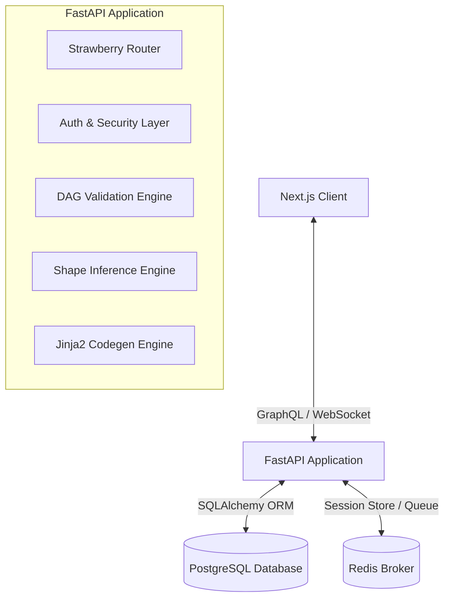

# MLBuilder Backend - Production-Ready API Server

MLBuilder is a visual machine learning architecture designer that enables developers to build, validate, and automatically compile deep learning models directly from a web canvas. 

This repository houses the production-grade, asynchronous FastAPI backend. It coordinates user authentication, graph-based canvas CRUD operations, Directed Acyclic Graph (DAG) validation, shape inference calculations, and Jinja2-based framework-specific code compilation (e.g. PyTorch).

---

## 🚀 Architectural Overview

The backend uses a highly decoupled, layered architecture to separate presentation, business logic, persistence, and external compiler engines:



---

## 🛠️ Technology Stack

* **Core Web Server**: [FastAPI](https://fastapi.tiangolo.com/) (Asynchronous, high-performance web framework for Python)
* **GraphQL Interface**: [Strawberry GraphQL](https://strawberry.rocks/) (Code-first GraphQL with Python type hints)
* **Object Relational Mapper**: [SQLAlchemy 2.0](https://www.sqlalchemy.org/) (Mapped type properties and high-efficiency pooling)
* **Database**: [PostgreSQL](https://www.postgresql.org/) (Storing users, canvases, nodes, and edges with JSONB configs)
* **Key-Value Store**: [Redis](https://redis.io/) (Task queuing broker and fast caching)
* **Code Generation**: [Jinja2](https://jinja.palletsprojects.com/) (Modular templates for compiling pure, commented neural network code)
* **Testing Suite**: [pytest](https://docs.pytest.org/) (Comprehensive automated logic validation)
* **Environment Isolation**: [Docker](https://www.docker.com/) & [Docker Compose](https://docs.docker.com/compose/)

---

## ✨ Features Checklist

* **Authentication & Cryptography**: Password hashing using native `bcrypt` (independent of passlib deprecations) and stateful `PyJWT` secure token verification.
* **Canvas Graph Management**: Fully relational CRUD services for Projects, Nodes, and Edges. Node configurations and shapes persist as native `JSONB` document configurations.
* **DAG Architecture Guard**: Topological sorting of network layers with automated cyclic relationship rejection and disconnected component validation.
* **Deterministic Shape Inference**: Layer-by-layer spatial and channel-wise shape compilation supporting `Input`, `Conv2D` (paddings, strides, channels), `MaxPool2D`, `Flatten`, and `Dense`/`Linear` blocks.
* **PyTorch Compiler**: Jinja2-powered Python code generation including layer initializers, sequential `forward` steps mapped with shape-tracking comments, and a runnable local verification script.

---

## 📂 Folder Directory Layout

```text
├── app/
│   ├── main.py                # FastAPI Application & router bootstrapping
│   ├── config/
│   │   ├── settings.py        # Environmental variables & Pydantic config
│   │   └── database.py        # SQLAlchemy engine, session maker & declarative base
│   ├── auth/
│   │   ├── security.py        # Password cryptography & JWT sign/verify
│   │   └── dependencies.py    # FastAPI dependencies & custom GraphQL Context getters
│   ├── models/
│   │   ├── __init__.py        # Metadata model registration hook
│   │   ├── user.py            # User account schemas
│   │   ├── project.py         # Canvas workspace schemas
│   │   ├── node.py            # Layer block details (JSONB configuration)
│   │   └── edge.py            # Connection routing & shapes
│   ├── services/
│   │   ├── auth_service.py    # Signup & login session management
│   │   ├── project_service.py # Project, node, and edge CRUD
│   │   ├── validation_service.py # Graph sorting & DAG integrity validation
│   │   └── shape_inference_service.py # Dynamic shape compiler math
│   ├── graphql/
│   │   ├── schema.py          # Unified Queries & Mutations schema entrypoint
│   │   └── types/             # Strawberry GraphQL ObjectTypes
│   └── codegen/
│       └── pytorch/
│           ├── generator.py   # Maps graph representation to PyTorch scripts
│           └── templates/
│               └── model.py.jinja2 # Jinja2 base templates for compiled code
├── tests/                     # Unit & Integration test suites
├── requirements.txt           # Package specifications
├── Dockerfile                 # Slim multi-stage Python setup
└── docker-compose.yml         # Dev/Prod local container orchestrations
```

---

## ⚙️ Setup & Local Installation

### Prerequisites
* Python 3.11+ installed locally
* PostgreSQL running locally (or running via Docker)

### Option A: The Fast Track (Docker Compose)
This starts the full suite (FastAPI server, PostgreSQL database, and Redis cache instance) out-of-the-box, mounting volumes for persistent data storage:

```bash
# Clone the repository and navigate to the directory
cd backend

# Spin up all containers in detached mode
docker-compose up --build -d
```
The GraphQL interactive Playground will be available immediately at: **`http://localhost:8000/graphql`**

---

### Option B: Local Running (No Docker)

**1. Create a Virtual Environment & Install Dependencies:**
```bash
python -m venv venv
# On Windows
venv\Scripts\activate
# On macOS/Linux
source venv/bin/activate

pip install -r requirements.txt
```

**2. Configure Environment Variables:**
Copy the `.env.example` file to `.env` and adjust database credentials as required:
```bash
cp .env.example .env
```

**3. Run the Development Server:**
```bash
uvicorn app.main:app --reload --port 8000
```
Visit **`http://localhost:8000/graphql`** to interact with the API.

---

## 🧪 Running Tests

To run the full suite of security, shape calculations, and codegen compiler tests:

```bash
python -m pytest -v
```

---

## 🚀 GraphQL API Usage Examples

The following are standard queries and mutations to execute in the `/graphql` playground.

### 1. User Registration (Signup)
```graphql
mutation {
  signup(
    email: "developer@example.com",
    username: "deep_dev",
    password: "SuperSecretPassword123"
  ) {
    token
    user {
      id
      email
      username
    }
  }
}
```

### 2. User Authentication (Login)
```graphql
mutation {
  login(
    email: "developer@example.com",
    password: "SuperSecretPassword123"
  ) {
    token
    user {
      id
      username
    }
  }
}
```

*Note: For all authenticated operations below, you must pass the returned JWT in your HTTP headers:*
```json
{
  "Authorization": "Bearer <YOUR_TOKEN>"
}
```

### 3. Create a Project Canvas
```graphql
mutation {
  createProject(
    name: "ResNet Block Mini",
    description: "A small CNN with convolution, pool, flatten, and dense projections",
    framework: "PyTorch"
  ) {
    id
    name
    framework
  }
}
```

### 4. Build the Network Layer-by-Layer (Add Nodes)
```graphql
mutation AddNodes {
  # Add Input Node
  inputNode: addNode(
    projectId: "<PROJECT_UUID>",
    type: "Input",
    label: "Input Image Layer",
    position: { x: 100.0, y: 100.0 },
    config: { shape: [null, 3, 224, 224] }
  ) { id type label }

  # Add Conv2D Node
  convNode: addNode(
    projectId: "<PROJECT_UUID>",
    type: "Conv2D",
    label: "Feature Conv1",
    position: { x: 100.0, y: 250.0 },
    config: { filters: 32, kernel_size: 3, stride: 2, padding: 1, activation: "relu" }
  ) { id type label }

  # Add MaxPool2D Node
  poolNode: addNode(
    projectId: "<PROJECT_UUID>",
    type: "MaxPool2D",
    label: "Downsample Pool1",
    position: { x: 100.0, y: 400.0 },
    config: { pool_size: 2, stride: 2 }
  ) { id type label }

  # Add Flatten Node
  flattenNode: addNode(
    projectId: "<PROJECT_UUID>",
    type: "Flatten",
    label: "Vector Flatten",
    position: { x: 100.0, y: 550.0 },
    config: {}
  ) { id type label }

  # Add Output Dense Node
  outputNode: addNode(
    projectId: "<PROJECT_UUID>",
    type: "Dense",
    label: "Logits Output",
    position: { x: 100.0, y: 700.0 },
    config: { units: 10, activation: "softmax" }
  ) { id type label }
}
```

### 5. Link the Nodes Together (Add Edges)
```graphql
mutation LinkNodes {
  e1: addEdge(projectId: "<PROJECT_UUID>", fromNodeId: "<INPUT_NODE_UUID>", toNodeId: "<CONV_NODE_UUID>") { id }
  e2: addEdge(projectId: "<PROJECT_UUID>", fromNodeId: "<CONV_NODE_UUID>", toNodeId: "<POOL_NODE_UUID>") { id }
  e3: addEdge(projectId: "<PROJECT_UUID>", fromNodeId: "<POOL_NODE_UUID>", toNodeId: "<FLATTEN_NODE_UUID>") { id }
  e4: addEdge(projectId: "<PROJECT_UUID>", fromNodeId: "<FLATTEN_NODE_UUID>", toNodeId: "<OUTPUT_NODE_UUID>") { id }
}
```

### 6. Compile Graph to PyTorch Code (Code Generation)
Executing this mutation automatically triggers:
1. **DAG verification** (cycles, connections validation)
2. **Deterministic shape propagation** (calculates exact shapes for all inputs/outputs)
3. **Database shape persistence** (updates node database records in place)
4. **Code generation rendering** (returns compiled Python script)

```graphql
mutation {
  generatePytorchCode(projectId: "<PROJECT_UUID>")
}
```
**Output Example:**
```python
import torch
import torch.nn as nn
import torch.nn.functional as F

class MLBuilderModel(nn.Module):
    """
    Generated PyTorch Model from MLBuilder Architecture Canvas.
    Name: ResNet Block Mini
    Framework: PyTorch
    """
    def __init__(self):
        super(MLBuilderModel, self).__init__()
        
        # Layer Definitions
        self.feature_conv1 = nn.Conv2d(in_channels=3, out_channels=32, kernel_size=3, stride=2, padding=1)
        self.downsample_pool1 = nn.MaxPool2d(kernel_size=2, stride=2, padding=0)
        self.vector_flatten = nn.Flatten(start_dim=1)
        self.logits_output = nn.Linear(in_features=100352, out_features=10)

    def forward(self, x):
        # x shape: [None, 3, 224, 224]
        
        # Forward execution flow
        x = self.feature_conv1(x)  # shape: [None, 32, 112, 112]
        x = F.relu(x)
        x = self.downsample_pool1(x)  # shape: [None, 32, 56, 56]
        x = self.vector_flatten(x)  # shape: [None, 100352]
        x = self.logits_output(x)  # shape: [None, 10]
        x = lambda t: F.softmax(t, dim=1)(x)
        
        return x
```
